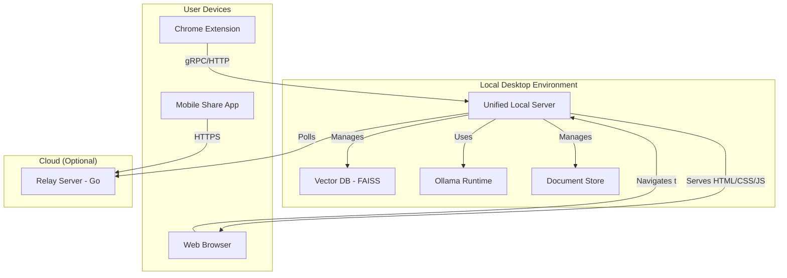

# LocalMind Implementation Plan

## 1. Introduction

This document outlines the development plan for LocalMind, a private, device-local knowledge base. The plan is derived from the Product Requirements Document (`docs/localMind_prd.md`) and focuses on an iterative approach, starting with a Minimum Viable Product (MVP) and progressively adding features.

## 2. Core Architecture

The system is composed of several key components that work together to provide the core functionality. The diagram below illustrates the high-level architecture.

## 3. Phase 1: MVP (v0.1) Implementation

This phase focuses on delivering the core functionality outlined in the PRD's MVP scope.

### Milestone 1: Core Backend & RAG Pipeline

The goal is to build the foundational local server and search functionality.

- **Task 1.1: Setup Desktop Daemon:**
  - Initialize a new Node.js project (e.g., using TypeScript with Express/gRPC).
  - Set up the main application loop and configuration management.
- **Task 1.2: Integrate Ollama:**
  - Write a service module to interact with the Ollama API.
  - Implement logic to manage two models as per the PRD (`all-MiniLM-L6-v2` for embeddings, Llama 3 8B for generation) and handle potential dual-instance configuration.
- **Task 1.3: Integrate FAISS Vector Store:**
  - Create a storage manager class to handle FAISS index creation, loading, and saving.
  - Implement functions for adding vectors and performing similarity searches.
- **Task 1.4: Build Document Store:**
  - Design a simple file-based or SQLite-based store for the original content and metadata.
- **Task 1.5: Implement Core RAG Pipeline:**
  - Develop the end-to-end logic: `Query -> Embed -> Search (FAISS) -> Retrieve Docs -> Format Prompt -> Generate Answer (Ollama)`.

### Milestone 2: Content Ingestion

This milestone focuses on getting data into the system.

- **Task 2.1: Develop Chrome Extension:**
  - Create a basic extension with a "Save to LocalMind" button.
  - Implement the logic to capture page content (HTML, text), URL, and metadata.
  - The extension will communicate with the Desktop Daemon via an HTTP/gRPC call.
- **Task 2.2: Implement Note-Taking:**
  - In the Desktop Daemon, create an API endpoint to receive and process new notes (title, body, tags).
  - Ensure notes are stored and indexed just like web pages.

### Milestone 3: Search UI

This milestone covers the user-facing application.

- **Task 3.1: Configure Static UI Serving:**
  - Modify the Desktop Daemon's Express server to serve the static files (HTML, CSS, JS) from the `search-ui` directory.
- **Task 3.2: Update UI API Calls:**
  - Change the `fetch` requests in the UI's JavaScript to use relative paths (e.g., `/search`) instead of absolute URLs.
- **Task 3.3: Remove Electron Dependencies:**
  - Delete Electron-specific files (`main.js`, `preload.js`).
  - Remove the `electron` package from the `search-ui`'s `package.json`.

### Milestone 4: Cross-Device Ingestion (Manual Relay)

This milestone delivers the MVP version of mobile-to-desktop syncing.

- **Task 4.1: Develop Golang Relay Server:**
  - Write a lightweight Go server with two endpoints: one to receive and store an encrypted blob, and one for the desktop client to poll and retrieve it.
  - Implement a simple in-memory or file-based store with a 24-hour TTL for blobs.
- **Task 4.2: Implement Desktop Polling:**
  - Add a module to the Desktop Daemon to periodically poll the relay server, download new content, and delete it from the server.
- **Task 4.3: Mobile Share Target Proof-of-Concept:**
  - Develop a basic iOS Share Extension or Android Share Target that sends a URL to the relay server.

## 4. Phase 2: Post-MVP Enhancements

Once the MVP is stable, work can begin on the v1.0 features.

- **Milestone 5: Security & Usability:**
  - Implement encryption at rest for the document and vector stores (AES-256).
  - Build the UI for managing tags.
  - Implement automatic tag suggestions based on content.
- **Milestone 6: Advanced Features:**
  - Enhance the mobile app for native clipping and on-device indexing.
  - Add summarization features for individual articles or collections.
  - Develop a browser sidebar for contextual suggestions.

## 5. Proposed Technology Stack

| Component             | Technology                               | Justification                                                 |
| --------------------- | ---------------------------------------- | ------------------------------------------------------------- |
| **Desktop Daemon**    | Node.js (TypeScript, Express/gRPC)     | Unifies the stack with Electron, simplifying the build process. |
| **Web UI Framework**  | Node.js + Vanilla JS/CSS/HTML            | Simplifies the stack, reduces dependencies, and is lightweight. |
| **Vector Search**     | FAISS                                    | Fast, efficient, and runs locally as specified in the PRD.    |
| **LLM Serving**       | Ollama                                   | Simplifies local model management as specified in the PRD.    |
| **Relay Server**      | Go                                       | Lightweight, fast, and ideal for a simple, high-performance API. |
| **Chrome Extension**  | JavaScript / TypeScript                  | Standard for browser extension development.                   |