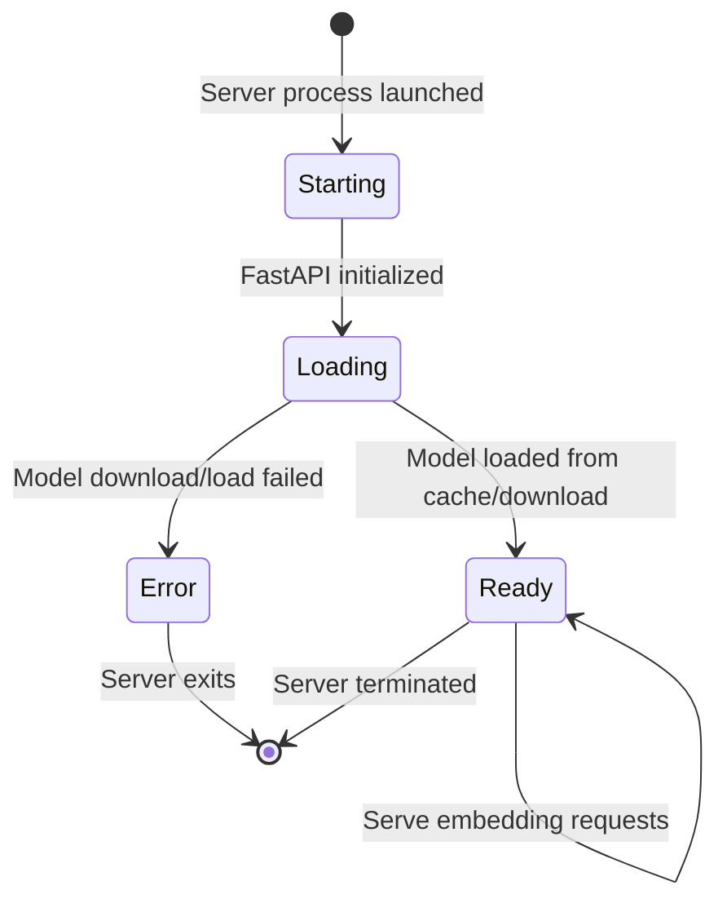
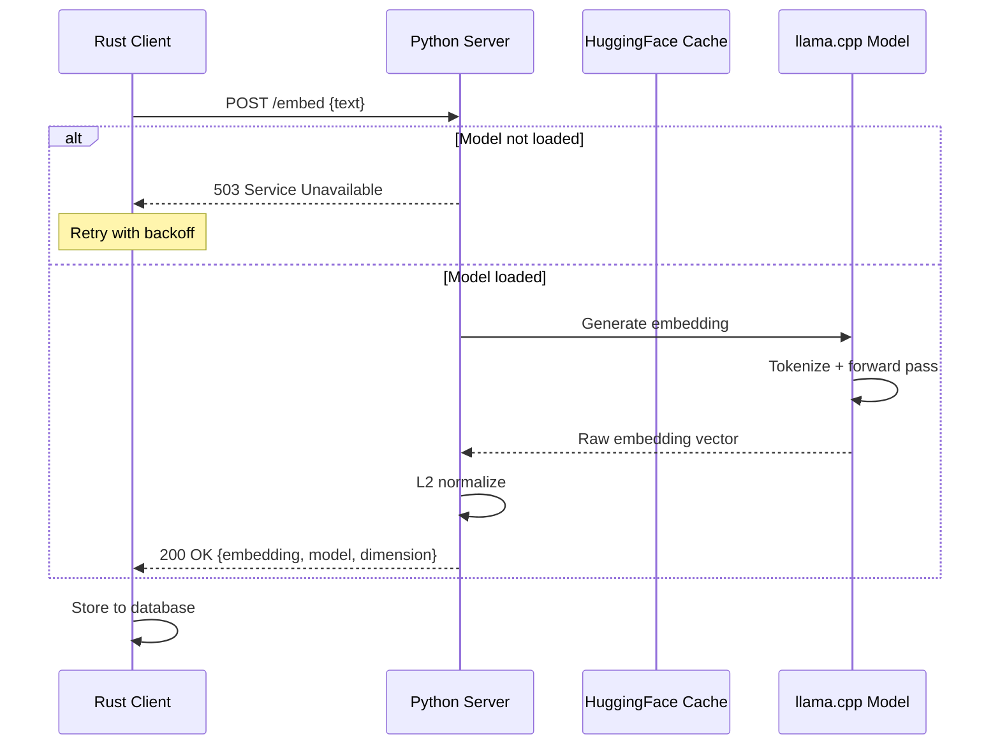

# Data Model: Headless LLM Migration

**Date**: 2025-01-21  
**Feature**: 005-headless-llms

## Overview

This document defines the data structures for the Python embedding server and Rust HTTP client communication.

## Python TypedDict Definitions

### EmbeddingRequest

Request body for `/embed` endpoint.

```python
from typing import TypedDict

class EmbeddingRequest(TypedDict):
    """Request to generate an embedding for text."""
    text: str  # Text to embed (typically a document chunk, ~500 chars)
```

**Validation Rules**:
- `text` MUST NOT be empty
- `text` SHOULD be <512 tokens (~2000 characters) to fit model context
- Server SHOULD return 400 Bad Request if text exceeds limits

---

### EmbeddingResponse

Response body for successful `/embed` request.

```python
from typing import TypedDict

class EmbeddingResponse(TypedDict):
    """Response containing the embedding vector."""
    embedding: list[float]  # 768-dimensional normalized vector
    model: str              # Model identifier (e.g., "embeddinggemma-300m-qat")
    dimension: int          # Always 768
```

**Validation Rules**:
- `embedding` MUST have exactly 768 elements
- `embedding` values MUST be normalized (L2 norm ≈ 1.0)
- `dimension` MUST always be 768

---

### Health Response

Response body for `/health` endpoint.

```python
from typing import TypedDict

class HealthResponse(TypedDict):
    """Health check response."""
    status: str          # "ok" if ready, "loading" if model still loading
    model_loaded: bool   # True if model is loaded and ready
```

**Validation Rules**:
- `status` MUST be one of: "ok", "loading", "error"
- `model_loaded` MUST be True when status is "ok"

---

### ErrorResponse

Error response for all endpoints.

```python
from typing import TypedDict

class ErrorResponse(TypedDict):
    """Error response body."""
    error: str           # Human-readable error message
    detail: str | None   # Optional detailed error information
```

**HTTP Status Codes**:
- `400 Bad Request`: Invalid input (empty text, text too long)
- `503 Service Unavailable`: Model still loading (Retry-After: 5)
- `500 Internal Server Error`: Unexpected server error

---

## Rust Struct Definitions

### Rust Client Request

```rust
use serde::{Serialize, Deserialize};

#[derive(Serialize, Deserialize, Debug)]
pub struct EmbeddingRequest {
    pub text: String,
}
```

---

### Rust Client Response

```rust
#[derive(Serialize, Deserialize, Debug)]
pub struct EmbeddingResponse {
    pub embedding: Vec<f32>,
    pub model: String,
    pub dimension: usize,
}
```

**Validation**:
- Deserialize JSON from Python server
- Verify `dimension == 768`
- Return `embedding` as `Vec<f32>` to caller

---

### Rust Client Error

```rust
#[derive(Serialize, Deserialize, Debug)]
pub struct ErrorResponse {
    pub error: String,
    pub detail: Option<String>,
}
```

---

## Database Schema (Unchanged)

The existing SQLite schema remains compatible:

```sql
CREATE TABLE IF NOT EXISTS embeddings (
    id INTEGER PRIMARY KEY AUTOINCREMENT,
    document_id INTEGER NOT NULL,
    chunk_text TEXT NOT NULL,
    chunk_index INTEGER NOT NULL,
    embedding BLOB NOT NULL,  -- 768 floats = 3072 bytes
    created_at TIMESTAMP DEFAULT CURRENT_TIMESTAMP,
    FOREIGN KEY (document_id) REFERENCES documents(id)
);
```

**No migration required** because:
- embedding dimension remains 768
- embeddinggemma-300m-qat produces same embeddings as before (same model, different runtime)

---

## State Transitions

### Python Server States



### Embedding Request Flow



---

## Validation Rules Summary

| Field | Type | Constraints | Error Handling |
|-------|------|-------------|----------------|
| `EmbeddingRequest.text` | str | Not empty, <2000 chars | 400 Bad Request |
| `EmbeddingResponse.embedding` | list[float] | Length == 768, normalized | Server assertion error |
| `EmbeddingResponse.dimension` | int | Always 768 | Server assertion error |
| `HealthResponse.status` | str | One of: ok, loading, error | N/A |

---

## Performance Characteristics

| Operation | Latency | Notes |
|-----------|---------|-------|
| Model load (first time) | 2-10 seconds | Downloads ~300MB GGUF file |
| Model load (cached) | 2-5 seconds | Loads from disk |
| Embedding generation | 50-200ms | CPU-dependent, per chunk |
| HTTP overhead | 1-5ms | Localhost only |
| **Total per-chunk** | **50-205ms** | Within <1s requirement |

---

## Next Steps

See `contracts/` directory for OpenAPI schema and `quickstart.md` for setup instructions.
